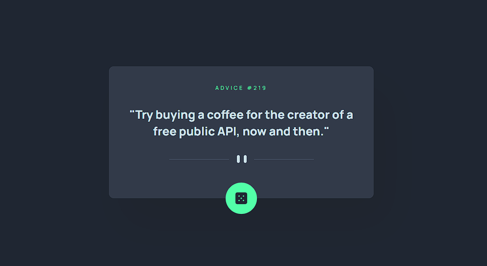

# Advice generator

This is a solution to the [Advice generator app challenge on Frontend Mentor](https://www.frontendmentor.io/challenges/advice-generator-app-QdUG-13db).

## :beginner: Overview

this app generates new advice on every button click.

[View demo](https://davitjabushanuri.github.io/advice-generator/)

## :camera:



## :zap: Usage

You can click on the Dice icon to generate new advice. it fetches random advice from [Advice Slip API](https://api.adviceslip.com).

### :notebook: Pre-Requisites

To get a local copy up and running follow these simple example steps.

- [git](https://git-scm.com/)
- [NodeJS](https://nodejs.dev/)
- [npm](https://npmjscom/)

### :electric_plug: Installation

After you've made sure to have all the tools installed, you should be able to just run a few commands to get set up

```
git clone git@github.com:davitJabushanuri/advice-generator.git
cd advice-generator
npm install
npm start
```

### :hammer: Built With

- [React](reactjs.org)
- [Sass](https://sass-lang.com/)
- [Flexbox](https://css-tricks.com/snippets/css/a-guide-to-flexbox/)

## :book: What I learned

How to delay a function call deliberately

```
const asyncTimeout = ms => {
		return new Promise(resolve => {
			setTimeout(resolve, ms)
		})
	}
```

Call this function in any other function with desired `ms` argument.For example `asyncTimeout(1000)`

```
	const getAdvice = async () => {
			setLoading(true)
			await asyncTimeout(500)
			const data = await fetch(adviceUrl)
			const advice = await data.json()
			setLoading(false)
			setAdvice(advice.slip.advice)
			setAdviceNumber(advice.slip.id)
	                }
```

`asyncTimeout` function makes sure `getAdvice` function will be delayed for at least 0.5 seconds

### :house: Development

- Add animations
- Add light theme

### 🤝 Contribution

Your contributions are always welcome and appreciated. Following are the things you can do to contribute to this project.

- **Report a bug**
  If you think you have encountered a bug, feel free to report it [here](https://github.com/davitJabushanuri/advice-generator/issues).
  <br/>
- **Request a feature**
  If you have a suggestion that would make this better, You can request for a feature [here](https://github.com/davitJabushanuri/advice-generator/issues) with the tag "enhancement".
  <br/>

- **Create a pull request**

  1. Fork the Project
  2. Create your Feature Branch (`git checkout -b feature/AmazingFeature`)
  3. Commit your Changes (`git commit -m 'Add some AmazingFeature'`)
  4. Push to the Branch (`git push origin feature/AmazingFeature`)
  5. Open a Pull Request
     <br/>

> If you are new to open-source, make sure to check read more about it [here](https://www.digitalocean.com/community/tutorial_series/an-introduction-to-open-source) and learn more about creating a pull request [here](https://www.digitalocean.com/community/tutorials/how-to-create-a-pull-request-on-github).

## :star2: Acknowledgment

- [Frontend Masters](https://www.frontendmentor.io/home)
- [React](reactjs.org)
